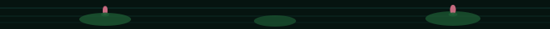

---

### 🐸 &nbsp; hey there — I'm **yourname** &nbsp; 🐸

I'm a developer who thrives in **still waters** — building calm, reliable systems that handle the chaos underneath.
I believe good code, like a good pond, has depth you can't always see.

Currently leaping between **full-stack web dev**, open source, and building tools that make other devs' lives easier.
When I'm not shipping, I'm somewhere watching the reflections.

---

 

## 🌿 &nbsp; `// pond.stats`

 

---

## 🪷 &nbsp; `// skills.lily`

 

---

## 🌊 &nbsp; `// projects.log`

<table align="center">
<tr>
<td width="50%" valign="top">

**🌿 &nbsp; [pond-ui](https://github.com/yourname/pond-ui)**

A calm, nature-inspired component library.
No noise, just clarity.

 &nbsp; ⭐ 142

</td>
<td width="50%" valign="top">

**🐸 &nbsp; [hopper](https://github.com/yourname/hopper)**

Lightweight task runner that hops across
services with zero config.

 &nbsp; ⭐ 89

</td>
</tr>
<tr>
<td width="50%" valign="top">

**🌊 &nbsp; [ripple-db](https://github.com/yourname/ripple-db)**

Event propagation system.
One change, many echoes.

 &nbsp; ⭐ 57

</td>
<td width="50%" valign="top">

**🍃 &nbsp; [duckweed](https://github.com/yourname/duckweed)**

Tiny floating utilities.
Fast, light, covers everything.

 &nbsp; ⭐ 203

</td>
</tr>
</table>

 

---

## 🐟 &nbsp; `// pond.activity`

 

---

## 🪷 &nbsp; `// find.me`

 

