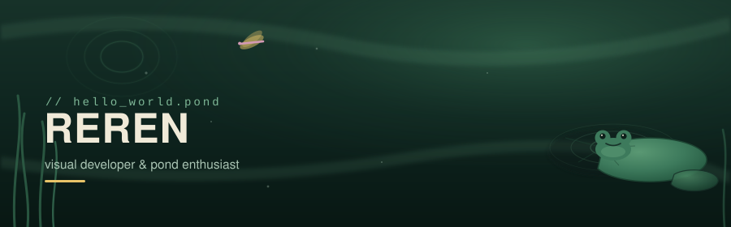
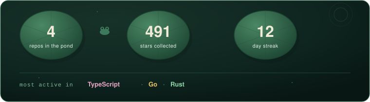

 

I build **visual, interactive systems** — component libraries, small tools, and the odd game.
Good code, like a good pond, has depth you don't see from the surface.

 

 

## 🌿&nbsp; `// pond.stats`

 

## 🪷&nbsp; `// skills.lily`

 

## 🌊&nbsp; `// projects.log`

<table align="center">
<tr>
<td width="50%" valign="top">

**🌿&nbsp; [pond-ui](https://github.com/yourname/pond-ui)**
A calm, nature-inspired component library. No noise, just clarity.
`JavaScript` &nbsp;·&nbsp; ⭐ 142

</td>
<td width="50%" valign="top">

**🐸&nbsp; [hopper](https://github.com/yourname/hopper)**
Lightweight task runner that hops across services with zero config.
`Go` &nbsp;·&nbsp; ⭐ 89

</td>
</tr>
<tr>
<td width="50%" valign="top">

**🌊&nbsp; [ripple-db](https://github.com/rerendikurr05/ripple-db)**
Event propagation system. One change, many echoes.
`Rust` &nbsp;·&nbsp; ⭐ 57

</td>
<td width="50%" valign="top">

**🍃&nbsp; [duckweed](https://github.com/rerendikurr05/duckweed)**
Tiny floating utilities. Fast, light, covers everything.
`TypeScript` &nbsp;·&nbsp; ⭐ 203

</td>
</tr>
</table>

 

## 🐟&nbsp; `// pond.activity`

 

## 🪷&nbsp; `// find.me`

 

